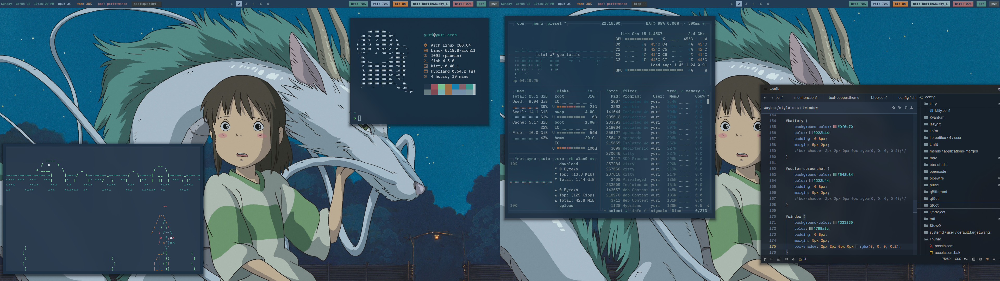

# 󱌁 Dotfiles

another stupid dotfiles :3



## 󰌆 Contents

This repository contains configuration files for:
- 󰌆 Hyprland (window manager)
- 󰒋 Waybar (status bar)
- 󰕍 Rofi (application launcher)
- �崿 Kitty (terminal emulator)
- 󰌤 Fish (shell)
- 󰎔 Starship (prompt)
- 󱔗 Dunst (notifications)
- 󰍛 Btop (system monitor)
- 󰂨 Fastfetch (system info)
- 󰕧 MPV (media player)
- 󰗀 GTK themes (2.0, 3.0, 4.0)
- 󰕳 PipeWire and WirePlumber (audio)

## 󱐋 Installation

To install these dotfiles using GNU Stow:

1. 󰐅 Clone this repository:
```bash
git clone https://github.com/yourusername/dotfiles.git
cd dotfiles
```

2. 󱍙 Install GNU Stow if not already installed:
```bash
# For Arch Linux
sudo pacman -S stow

# For Ubuntu/Debian
sudo apt install stow

# For Fedora
sudo dnf install stow

# For macOS (using Homebrew)
brew install stow
```

3. � Maldonado dependencies (example for Arch Linux):
```bash
sudo pacman -S hyprland waybar rofi kitty fish starship dunst btop fastfetch mpv pipewire wireplumber gtk3 gtk4
```

4. 󰚩 Use Stow to symlink the configuration files:
```bash
# Stow each module individually
stow hypr
stow waybar
stow rofi
stow kitty
stow fish
stow starship
stow dunst
stow btop
stow fastfetch
stow mpv
stow gtk-2.0
stow gtk-3.0
stow gtk-4.0
stow pipewire
stow wireplumber
```

5. 󰊗 Enjoy dumbo

## 󰨇 Customization

Feel free to modify any of the configuration files to suit your preferences. The screenshot shows the default vibe of the config
